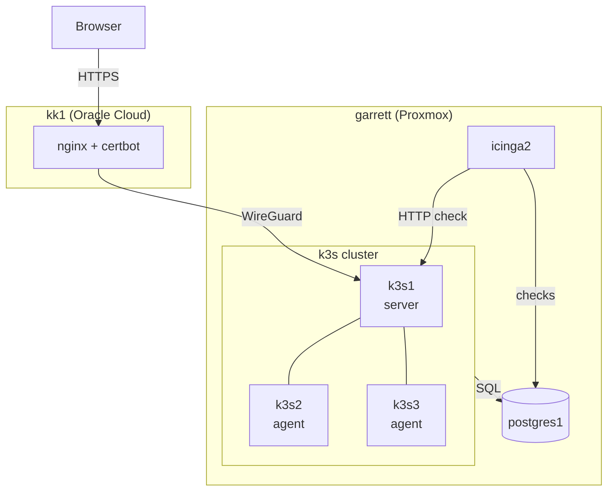

# homelab-automation

Terraform and Ansible that build a small k3s cluster on Proxmox, run a
Flask + PostgreSQL task app on it, and serve it publicly over TLS at
[tasks.greenbean.org](https://tasks.greenbean.org).

## What's in it

Six hosts, all built from this repo:

- **garrett (Proxmox)** — five LXCs provisioned with Terraform:
  `k3s1` (server), `k3s2` and `k3s3` (agents), `postgres1`, `icinga2`
- **kk1 (Oracle Cloud)** — nginx + certbot reverse proxy, connected
  back to the home network over WireGuard

Ansible configures all six.

All three k3s nodes are LXCs on the same physical host, so this is a
working multi-node cluster, not real fault tolerance.

## Stack

- **Terraform** (`bpg/proxmox` provider) — Proxmox LXCs
- **Ansible** — configuration for every host, including `kk1`
- **PostgreSQL** — app database
- **k3s** — runs the Flask app across three nodes
- **Icinga2** — HTTP, ICMP, and a custom SQL check against app data
- **nginx + certbot** — public TLS and rate limiting

## Build order

1. Throwaway Terraform smoke test to prove the Terraform → Proxmox →
   Ansible loop
2. Icinga2 and PostgreSQL hosts
3. k3s server and the containerized Flask app
4. Monitoring checks
5. Public exposure through nginx on `kk1` over WireGuard
6. Two more k3s agents, rate limiting, and input validation

## Things I ran into

- Proxmox API tokens are capped by the owning user's permissions
  under Privilege Separation
- Unprivileged LXCs need `nesting` enabled, or SSH logins hang for
  ~25 seconds waiting on systemd-logind
- Minimal LXC templates don't include `sudo`, which breaks Ansible
  `become_user` tasks
- A schema-level GRANT in PostgreSQL doesn't cover tables owned by
  another role; the fix was explicit per-table grants
- `hostalive` misreads this host's `ping` output; I switched to
  `check_icmp`
- Ansible re-templating the nginx config was wiping certbot's SSL
  changes; the template task is now skipped once a cert exists

## Security

- Secrets live in gitignored files, never committed
- Read-only, purpose-built credentials for the status panel
  (Icinga2 API and Kubernetes)
- nginx rate limiting plus app-side input validation
- `no_log` on tasks that handle passwords

## Known gaps

- Single physical host, so no real fault tolerance
- No container registry; each node builds the image locally
- No alerting or Icinga Web dashboard yet

## How this was built

I used Claude heavily as a pair-programming and debugging assistant,
especially for the Kubernetes pieces. I've reviewed the Terraform and
Ansible line by line. The k3s layer works, but I haven't done much with
it since getting it running; hands-on Kubernetes is what I'm learning now.
